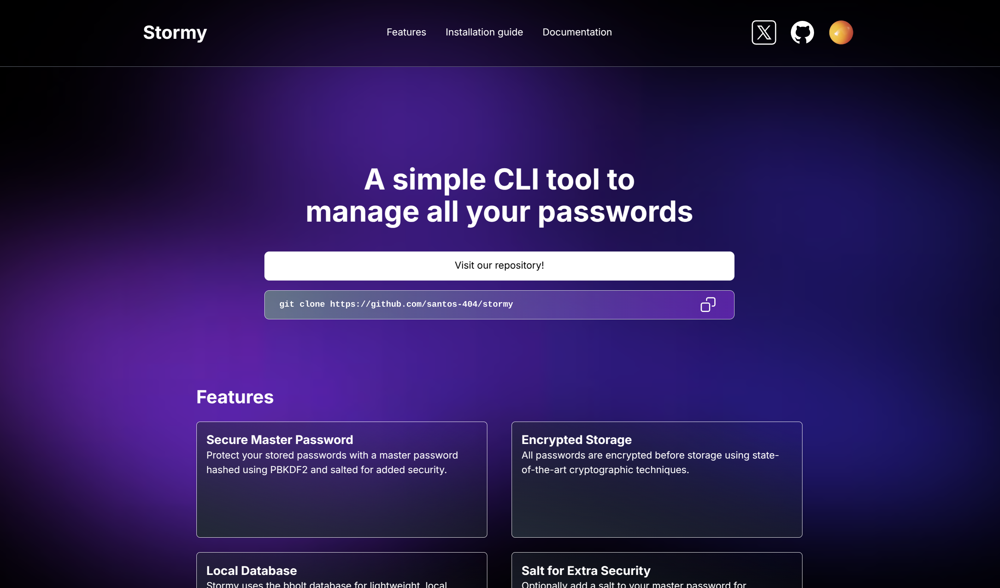

# Stormy - Secure Password Manager CLI

Stormy is a lightweight, secure, and user-friendly command-line interface (CLI) password manager written in Go. It uses **bbolt** for local storage and incorporates strong encryption to keep your passwords safe. With Stormy, you can manage your credentials directly from your terminal with speed and efficiency.

---

## 🔒 Features

- **Secure Master Password**: Protect your stored passwords with a master password hashed using PBKDF2 and salted for added security.
- **Encrypted Storage**: All passwords are encrypted before storage using state-of-the-art cryptographic techniques.
- **Local Database**: Stormy uses the **bbolt** database for lightweight, local storage.
- **Salt for Extra Security**: Optionally add a salt to your master password for enhanced protection.
- **Command-line Simplicity**: Add, retrieve, and manage your passwords entirely from the terminal.

---

## 🌐 Landing Page

We're building a modern, responsive landing page for Stormy using **Astro**. This page will serve as the central hub for installation guides, documentation, and additional resources.

You can visit the web clicking here [Stormy CLI](http://stormyCLI.vercel.app).




---

## 🚀 Installation

### Option 1: Download a ZIP

> ⚠️ Why this method? The ZIP file excludes non-essential files, like the landing page, keeping your download size small and focused on the tool.

1. Download the ZIP file:
    - Go to the [Stormy GitHub repository](https://github.com/javsanmar5/stormy).
    - Click on the Code button and select Download ZIP.

2. Unzip the repository:
   ```bash
   unzip stormy-main.zip
   cd stormy-main
    ```


3. Build the project:
    ```bash
    go build -o stormy
    ```


4. Move the binary to your $PATH for global access:
    ```bash
    sudo mv stormy /usr/local/bin
    ```


5. Verify the installation:
    ```bash
    stormy --help
    ```

### Option 2: Cloning the repository

If you need the full repository, including the landing page and other resources, you can clone it:

1. Clone the repository:
   ```bash
   git clone https://github.com/javsanmar5/stormy.git
   cd stormy
    ```

 
2. Build the project:
    ```bash
    go build -o stormy
    ```


3. Move the binary to your $PATH for global access:
    ```bash
    sudo mv stormy /usr/local/bin
    ```


4. Verify the installation:
    ```bash
    stormy --help
    ```
---

## 📖 Usage

1. **Set a Master Password**. 
Before saving any passwords, set a master password to secure your data:

    ```bash
    stormy set-master-password [password] --salt [optional-salt]
    ```


2. **Add a password**.
Save a new password for a service:

    ```bash
    stormy add --service [service-name] --username [username] --password [password]
    ```
    
    
3. **Retrieve a password**.
Retrieve a stored password:
    ```bash
    stormy get --service [service-name] --username [username]
    ```

    
4. **Delete a password**.
Remove a password from the database:
    ```bash
    stormy delete --service [service-name] --username [username]
    ```


5. **List all services**.
View all the services for which passwords are stored:

    ```bash
    stormy services
    ```

6. **List all passwords saved.**
View all your passwords stored in stormy, you can filter by a service.
    
    ```bash
    stormy list --service [optional-service-name]
    ```


---

## ⚙️ Commands Overview
| Command |	Description |
|-------------|----------|
| set-master-password |	Set your master password with an optional salt. |
| add | Save a new password for a specific service.
| get | Retrieve a password for a specific service and user. |
| delete | Delete a stored password for a service.
| services | List all stored services.|
| list | List all stored passwords. You can filter by service.|
| **help** |	Show detailed help for any command. |

---

## 🛡️ Security Practices

- **No Plaintext Storage**: Stormy never stores plaintext passwords or master passwords.
- **PBKDF2 and Salting**: Master passwords are hashed with PBKDF2 and salted for strong resistance against brute-force attacks.
- **Encryption**: Passwords are encrypted before being stored in the database.

---

## 📝 License

Stormy is licensed under the MIT License. You’re free to use, modify, and distribute it under the terms of this license.


---

## 📧 Support and Contributions

If you encounter any issues or have suggestions for improvement, feel free to open an issue in the GitHub repository. I will really appreciate it.

About contributing to the project.Contributions are welcome! If you'd like to contribute to this project, please follow these steps:

1. **Generate an Issue:**
   - Before making changes, create an issue to discuss the proposed changes or feature.

2. **Fork the Repository:**
   - Click the "Fork" button at the top of this repository to create your own copy.

3. **Create a Branch:**
   - Create a new branch for your changes:
     ```bash
     git checkout -b explain-your-changes
     ```

4. **Make Your Changes:**
   - Make your changes in the new branch.
   - Follow the project's coding conventions and style.

5. **Commit and Push:**
   - Commit your changes with a descriptive commit message:
     ```bash
     git commit -m "[cli/feature]: Add a descriptive message about your changes"
     ```

6. **Submit a Pull Request (PR):**
   - Go to the original repository.
   - Click on the "Pull Requests" tab and then click "New Pull Request."
   - Compare your fork's branch to the main repository's branch.
   - Add a detailed description of your changes and link to the issue you created.
   - Submit the PR for review.

### Guidelines for Contributors:
- Ensure your code follows the project standards and includes proper documentation.
- Check for open issues or discussions before starting work on a new feature.
- Avoid submitting large PRs; try to keep changes focused and modular.

Thank you for your interest in contributing to this project! 😊
